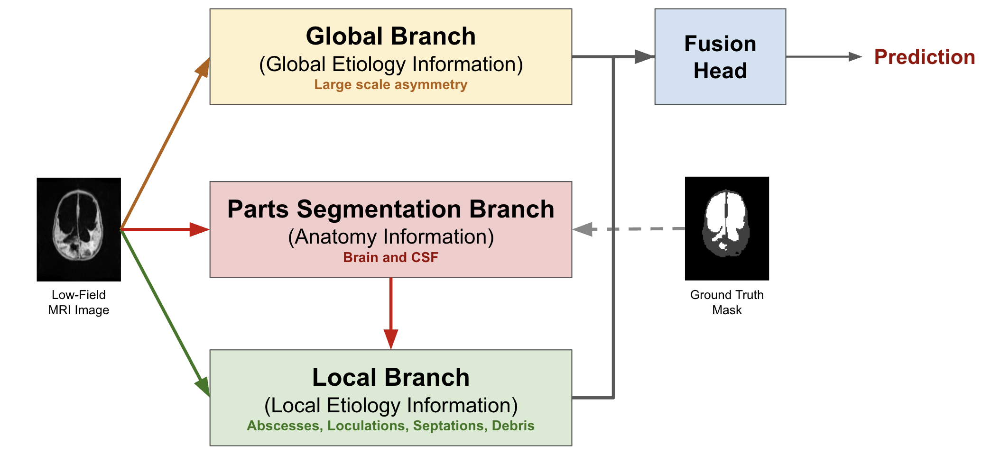
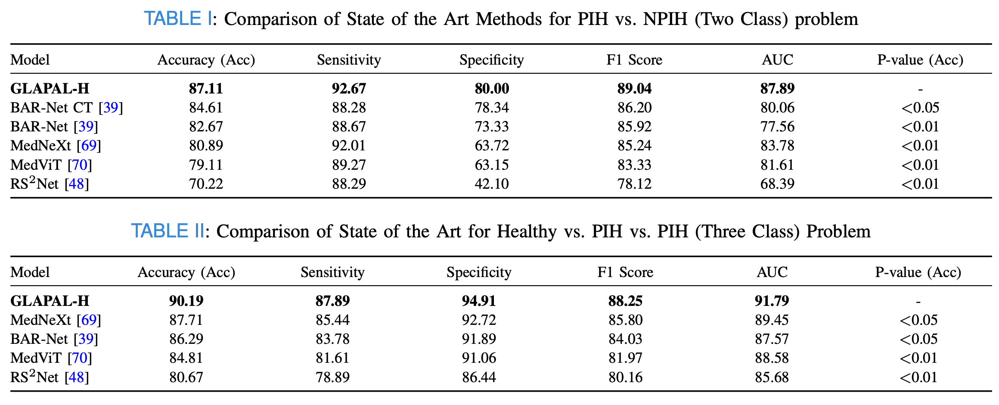
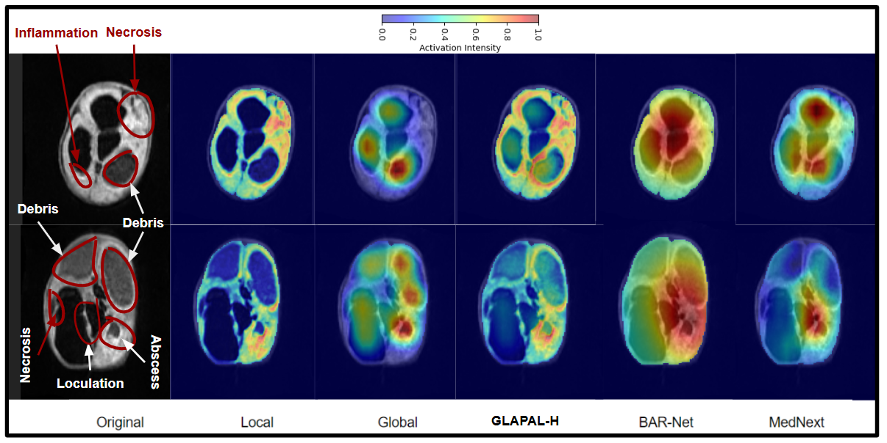

# **GLAPAL-H**  
### *Global, Local And Parts Aware Learner for Hydrocephalus Infection Diagnosis in Low-Field MRI*  
**IEEE Transactions on Biomedical Engineering**

---

## 🧠 Abstract

Hydrocephalus, marked by abnormal cerebrospinal fluid (CSF) accumulation, poses a global pediatric neurosurgical challenge. In sub-Saharan Africa, post-infectious hydrocephalus (PIH) accounts for over 50% of cases, while non-post-infectious hydrocephalus (NPIH) arises from causes such as hemorrhage or congenital malformations. Accurate differentiation among healthy, PIH, and NPIH infants is vital for effective management, as surgery must sometimes be delayed during active infections.

While CT imaging exposes children to ionizing radiation, low-field MRI offers a safer and more accessible alternative, particularly in resource-constrained settings. However, its low resolution presents diagnostic challenges. To address this, we propose **GLAPAL-H**, a *Global, Local, And Parts Aware Learner*, designed to robustly classify hydrocephalic etiology using low-field MRI.

GLAPAL-H incorporates a multi-task architecture with global, local, and parts-aware branches. The model simultaneously segments brain tissue and CSF, using shallow CNNs for local features and deep CNNs for global features. It introduces domain-guided loss functions for each branch, capturing visual cues of hydrocephalic pathology. GLAPAL-H outperforms CT-based and state-of-the-art models in Two-Class (PIH vs. NPIH) and Three-Class (PIH vs. NPIH vs. Healthy) tasks, offering superior generalizability, interpretability, and speed—positioning it as a viable tool for rapid diagnosis in low-resource clinical settings.

---

## 🎯 Motivation

- **Clinical Challenge**: Hydrocephalus demands early and precise differentiation between PIH, NPIH, and healthy infants, especially in sub-Saharan contexts.
- **Imaging Barrier**: CT scans expose children to radiation risks. Low-field MRI offers a 10× cheaper, safer alternative—but suffers from quality issues.
- **AI Opportunity**: Need for an explainable, efficient, and etiology-guided model that performs well on noisy, low-resolution MRI.

---

## 🧩 GLAPAL-H: Model Overview

GLAPAL-H consists of three key branches:

- **Global Branch**: Captures holistic structural features via deep CNN.
- **Local Branch**: Focuses on fine-grained anatomical regions using shallow CNN.
- **Parts Branch**: Learns soft segmentation masks to align parts-level activations with hydrocephalic etiology.

Each component is trained with a specialized loss:
- Global Regularizer → holistic features  
- Local Regularizer → fine, localized cues  
- Parts Regularizer → soft attention on infection-relevant regions  

This design aligns with domain knowledge of disease manifestation, improving both **trust** and **performance**.

---

## 📊 Results

- **Outperforms** state-of-the-art MRI and CT-based classifiers in both binary and ternary classification.
- **Improved generalizability** to new patients and imaging artifacts.
- **Faster training** and **lower inference time** due to shallow-deep hybrid design.

---

## 🔍 Interpretability

- Activation maps reveal **clinically meaningful regions** associated with infection.
- Parts-aware attention boosts **explainability** and **clinical trust**.

---

## 🔗 Code Repository

You can find the full PyTorch implementation of GLAPAL-H here:  
[🔗 GitHub: mukherjeesrijit/glapalh](https://github.com/mukherjeesrijit/glapalh)

---

## 📚 References

1. Mukherjee, Srijit, et al. *"GLAPAL-H: Global, Local, And Parts Aware Learner for Hydrocephalus Infection Diagnosis in Low-Field MRI."*  
   medRxiv (2025): 2025-05.  
   [📄 Read on medRxiv](https://www.medrxiv.org/content/10.1101/2025.05.14.25327461v2)
